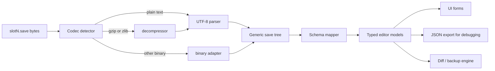
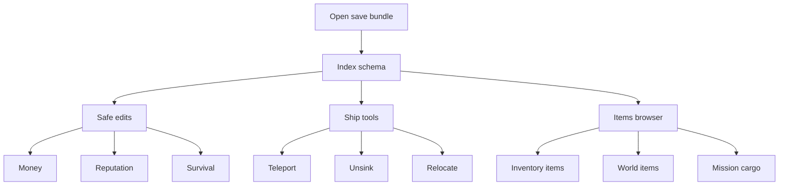
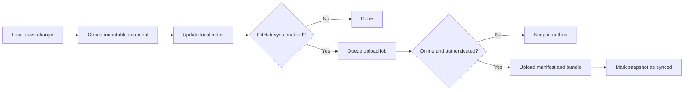

# Modern Desktop Save Manager for Sailwind

> Research input, not the current implementation specification. Confirmed and later decisions in `plan-16.md` take precedence where this report differs from the living plan. In particular, the accepted MVP uses Svelte 5 with Vite rather than SvelteKit, excludes save decoding/editing and GitHub synchronization, and keeps complete filesystem-changing workflows inside auditable Rust commands.

## Executive Summary

Sailwind is a Unity game by Raw Lion Workshop, and its core saves are stored in Unity’s per-user `persistentDataPath`, not in the installation directory. On Windows, that means `%USERPROFILE%\AppData\LocalLow\Raw Lion Workshop\Sailwind`; on Linux/Steam Deck via Proton, the practical path is inside the Steam compatibility prefix at `.../compatdata/1764530/pfx/drive_c/users/steamuser/AppData/LocalLow/Raw Lion Workshop/Sailwind`. Sailwind’s current Steam build is Windows-only, so any macOS or native Linux paths are best understood as the default Unity locations a native build would use, not as currently verified Steam depots. Those native Unity defaults would be `~/Library/Application Support/unity.Raw Lion Workshop.Sailwind` on macOS Player and `~/.config/unity3d/Raw Lion Workshop/Sailwind` on Linux Player. A mod called PortableSaves can deliberately switch Sailwind to a per-installation save location under `Sailwind/Sailwind_Data/Saves`. citeturn8search0turn42view0turn44search1turn23view0turn38view0turn19view0

The publicly documented save naming convention is `slot0.save` through `slot5.save`, with the first game commonly landing in `slot1.save`. The community and mod ecosystem also recognize companion artifacts such as `slotN_backup1.save` through `slotN_backup5.save`, `slotN.save.meta`, and `slotN.save.png`. Public reverse-engineering shows that the save payload exposes a structured object-and-array schema with paths such as `currency[i]`, `playerReputation[i]`, `food`, `sleep`, `savedObjects`, and `savedPrefabs`. However, I did **not** find a primary-source developer specification that conclusively documents the **on-disk encoding** as plain JSON, compressed JSON, or another binary serializer. What is well-supported is the semantic structure that editors such as SaveEditOnline can round-trip and that the community edits successfully. citeturn23view0turn18view1turn18view3turn19view3turn21view0turn20search0

For a modern save-manager app, the best fit is a **Tauri + TypeScript** desktop app, ideally with **SvelteKit** or **React** on the frontend and a small Rust backend for file IO, backup/versioning, and optional GitHub sync. Tauri’s strongest advantages are small binaries, OS-native WebView usage, strong TypeScript ergonomics on the frontend, and straightforward packaging for Windows/macOS/Linux. Neutralino is lighter still, but its ecosystem and long-term contributor ergonomics are weaker. Flutter and .NET MAUI are perfectly viable, but they are heavier choices for a save manager whose core job is structured file editing, diffing, and backup orchestration. NodeGui is appealing for native widgets and low memory, but its ecosystem is smaller and packaging/tooling are less mainstream than Tauri’s. citeturn31search8turn31search12turn45search5turn45search2turn31search5turn30search13turn31search7turn45search3turn45search9

The most robust product design is an **offline-first save manager** with automatic local snapshots, metadata indexing, schema-aware editing for common fields, binary-safe raw backups, and optional GitHub backup to a dedicated repository. For remote sync, GitHub’s device flow is well-suited to desktop apps, and a GitHub App or a tightly scoped fine-grained token is preferable to broad classic PAT usage. Rate limits are generous for a save manager if the app avoids polling and only syncs on user action or debounced local changes. citeturn32search0turn32search14turn32search6turn32search3turn34search0turn34search6turn34search9

## Verified Save Locations and File Layout

### What is verified today

Sailwind’s Steam store page currently lists Windows system requirements, and SteamDB shows a single app package/depot footprint instead of separate macOS/Linux native depots in the sources surfaced here. In practical terms, the currently verified distribution is a Windows build, including when run on Steam Deck through Proton. Community documentation and discussion consistently place the save folder under Unity’s Windows `LocalLow` path, and Steam Deck instructions point to the Proton prefix for AppData. Community posts also state that Sailwind saves are local rather than cloud-synced between machines. citeturn42view0turn44search1turn23view0turn25search6turn37view0

### Core save paths by platform and variant

| Scenario | Path | Per-user or per-installation | Confidence | Evidence |
|---|---|---:|---|---|
| Windows Steam or any standard Windows build using Unity defaults | `%USERPROFILE%\AppData\LocalLow\Raw Lion Workshop\Sailwind` | Per-user | High | Unity documents Windows Player `persistentDataPath` as `AppData\LocalLow\<company>\<product>`, and Sailwind community docs fill in `Raw Lion Workshop` / `Sailwind`. citeturn8search0turn23view0turn22view0 |
| Steam Deck / Linux running the Windows build under Proton | `<SteamLibrary>/steamapps/compatdata/1764530/pfx/drive_c/users/steamuser/AppData/LocalLow/Raw Lion Workshop/Sailwind` | Per-user within Proton prefix | High | Sailwind wiki documents the Steam Deck Proton path; PCGamingWiki’s snippet matches the same compatdata layout. citeturn23view0turn12search5 |
| Native Linux build, if one exists later or outside current Steam build | `$XDG_CONFIG_HOME/unity3d/Raw Lion Workshop/Sailwind` defaulting to `~/.config/unity3d/Raw Lion Workshop/Sailwind` | Per-user | Medium | This follows Unity’s official Linux Player `persistentDataPath`; I did not verify a current native Linux Sailwind depot in the sources reviewed. citeturn8search0turn42view0turn44search1 |
| Native macOS build, if one exists later or outside current Steam build | `~/Library/Application Support/unity.Raw Lion Workshop.Sailwind` | Per-user | Medium | This follows Unity’s official macOS Player `persistentDataPath`; I did not verify a current native macOS Sailwind depot in the sources reviewed. citeturn8search0turn42view0turn44search1 |
| PortableSaves mod enabled | `<Sailwind install>/Sailwind_Data/Saves` | Per-installation | High | The PortableSaves mod explicitly redirects save/load to `Sailwind/Sailwind_Data/Saves`. citeturn38view0 |

Because Unity separates install data from save data, `Application.dataPath` points to the game’s installation data folder and is read-only for save purposes on desktop platforms; Sailwind’s normal saves therefore belong in `persistentDataPath`, not beside the executable. That distinction matters for your app: the default detection flow should scan the Unity per-user path first, then optionally detect the PortableSaves override if the mod is installed. citeturn8search0turn8search3turn38view0

### File set your manager should recognize

The publicly visible save-slot ecosystem is broader than just `slotN.save`. The community wiki documents the main slot files as `slot0.save` through `slot5.save`, and the mod ecosystem copies or deletes companion files named `slotN.save.meta`, `slotN.save.png`, and backup files `slotN_backup1.save` through `slotN_backup5.save`. SaveSlotsPlus also treats a per-slot directory `slotN/` as a container for mod-specific save payloads. That is enough to design a manager that treats a “save” as a **bundle** rather than as one file. citeturn23view0turn18view1turn18view2turn18view3turn19view3

A practical bundle model is:

```text
slot2.save
slot2.save.meta
slot2.save.png
slot2_backup1.save
slot2_backup2.save
slot2_backup3.save
slot2_backup4.save
slot2_backup5.save
slot2/                 # optional, mainly mod-sidecar data
```

One additional implication is important for backup UX: players in Steam discussions explicitly rely on these backups to recover from bugs, and mods such as ModSaveBackups hook into the game’s backup behavior to keep sidecar mod saves aligned with the main save’s backup rotation. A save manager should therefore preserve both the primary slot and any sidecars atomically. citeturn25search6turn39view0

## Save Formats, Known Schema, and Editing Surface

### What is known with high confidence

Publicly accessible reverse-engineering shows that Sailwind saves expose a tree-like data model with arrays and nested records, including at least these path families: `currency[i]`, `playerReputation[i]`, scalar survival stats such as `food`, `foodDebt`, `vitamins`, `protein`, `water`, `sleep`, `sleepDebt`, a `time` field, `savedObjects` for world objects including ships and the player, and `savedPrefabs` for items. Community editors and guides operate on these field paths successfully, which is strong evidence that the serialized game state maps to a structured record format rather than opaque blobs. citeturn23view0turn21view0turn22view0

What I could **not** verify from a primary source is the exact **byte-level encoding** of `slotN.save` on disk. I did not find an official developer specification, an official decoding tool, or a published serializer implementation from Raw Lion Workshop. Because SaveEditOnline supports many engines and formats, its support for Sailwind proves editability but not whether the file is plain JSON, compressed JSON, or another serialized container. For a production save manager, the correct engineering response is to separate the **schema layer** from the **codec layer** so that the app can adapt once the exact codec is conclusively identified from real sample files. citeturn20search0turn23view0turn21view0

### The best-supported public schema map

| Area | Known field path or pattern | Notes | Evidence |
|---|---|---|---|
| Save slots | `slot0.save` … `slot5.save` | Six visible slots; first game commonly defaults to `slot1.save`. | citeturn23view0 |
| Money | `currency[0..3]` | Community wiki maps the indices to Al’Ankh Lions, Emerald Dragons, Aestrin Crowns, Gold. Community posts also refer to `playerCurrency` in newer versions. | citeturn23view0turn22view0 |
| Reputation | `playerReputation[0..2]` | Region reputation arrays. Wiki suggests `60000` as “max missions allowed.” | citeturn23view0 |
| Survival stats | `food`, `foodDebt`, `vitamins`, `protein`, `water`, `sleep`, `sleepDebt` | Straight scalar edits. | citeturn23view0 |
| Time of day | `time` | Decimal hours, e.g. `11.5` = 11:30 AM. | citeturn23view0 |
| Player position | `savedObjects > 0 > position > x/y/z` | Player is represented as `savedObjects > 0`. | citeturn23view0 |
| Ships | `savedObjects > N` | Ships live under `savedObjects`; sail-bearing ships can be found via `customization > sails`. | citeturn21view0turn23view0 |
| Mooring lines | adjacent `savedObjects` | Each ship has four mooring-line objects, with `extraSetting` indicating attached state. | citeturn23view0 |
| Item instances | `savedPrefabs > N` | Contains item identity and placement data. | citeturn23view0 |
| Item type | `savedPrefabs > N > prefabIndex` | Example: wiki states `79` is a fishing hook. | citeturn23view0 |
| Item storage | `inventorySlot` | `-1` means not in player inventory; `0..4` means inventory slots. | citeturn23view0 |
| Item health/amount/mission | `itemHealth`, `itemAmount`, `itemMissionIndex` | Public meanings are partially reverse-engineered and not fully authoritative. | citeturn23view0 |

### Schema drift across Early Access

A save-manager app for Sailwind should assume **schema drift**. Older community guides tell users to edit `playerGold` directly, while newer guidance points to `currency[i]` or `playerCurrency`. The game is still in Early Access, and the patch-notes history shows frequent changes to saving and loading behavior, with explicit notes about old saves usually working and users being advised to make backups. That means your editor should prefer **field discovery and schema versioning** over hard-coding a single flat field list. citeturn35search3turn22view0turn23view0turn44search5

### Tools and parser strategy

The most useful currently available public tool is **SaveEditOnline**, because it already round-trips Sailwind’s save payload into an editable tree. Community documentation relies on it heavily. That makes it valuable as a reverse-engineering aid, but not a strong foundation for a desktop product because it is external, browser-based, and not a stable API contract. citeturn20search0turn23view0turn22view0

For your app, I would implement a **codec abstraction** and a **schema abstraction** separately:



That design lets you start productively even with incomplete certainty at the byte level. In practice, I would begin with these handling layers:

| Layer | Recommended approach | Why |
|---|---|---|
| Raw inspection | Hex viewer plus magic-byte detection | Necessary because the public sources do not conclusively prove the on-disk codec. |
| Text/JSON path | UTF-8 parse into generic value tree | Supports the scenario where the save is plain or minimally wrapped structured text. |
| Compression path | Detect and inflate common wrappers before parsing | Many game saves wrap structured data. |
| Schema mapping | Convert generic tree paths into typed models | Keeps the UI stable across minor schema changes. |
| “Unknown fields” pass-through | Preserve all unrecognized fields losslessly | Critical for Early Access compatibility. |

For implementation libraries, the best fit depends on your chosen stack, but the core idea is stable: use a **lossless tree representation**, avoid rewriting unknown nodes, and preserve ordering and sidecars exactly. The app should always offer “raw bundle backup” before any modification.

## Common Manual Edits and What Fields to Change

### Money, reputation, and survival stats

The most common edits are straightforward scalar changes. The current best-supported money mapping is:

- `currency[0]` = Al’Ankh Lions
- `currency[1]` = Emerald Dragons
- `currency[2]` = Aestrin Crowns
- `currency[3]` = Gold citeturn23view0turn22view0

Region reputations are similarly direct through `playerReputation[0..2]`, and routine “recovery from bug” edits often include survival bars such as `food`, `water`, `sleep`, and related debt fields. The wiki documents the intended ranges informally, usually around `0` to `100`, with `60000` cited as a high mission-unlock threshold for reputation. citeturn23view0

A save manager should therefore provide a first-class “Safe Edits” panel with typed controls for:

| Edit | Field(s) | Example |
|---|---|---|
| Add local-region money | `currency[0]`, `currency[1]`, `currency[2]`, `currency[3]` | Set `currency[2] = 2500` to add Aestrin Crowns. citeturn23view0turn22view0 |
| Max mission access | `playerReputation[0..2]` | Set selected region reputation to `60000`. citeturn23view0 |
| Refill food/water/sleep | `food`, `water`, `sleep`, optionally `foodDebt`, `sleepDebt` | Set bars to `100` after a bad bug recovery. citeturn23view0 |
| Change time of day | `time` | `8` for 08:00, `11.5` for 11:30. citeturn23view0 |

### Position edits for player and ships

The player is represented as `savedObjects > 0`, and moving the player means editing its `position > x/y/z`. The community wiki warns that inventory-held items may not follow automatically unless their corresponding saved prefabs are also adjusted. That is precisely the kind of operation your app should label “advanced” and gate behind a backup prompt. citeturn23view0

The wiki also documents canonical coordinates for several ship and dock positions, and provides an approximate relationship between map coordinates and world coordinates using a `/9000` conversion. That enables a useful feature for your app: a “teleport to known port” action that writes curated coordinates instead of forcing users to hand-edit X/Y/Z values. citeturn23view0turn35search6

### Ship purchase, relocation, and unsinking

Public guides describe ships as `savedObjects > N`, with nearby mooring-line objects represented as adjacent object indices. To “purchase” a ship by editing, the wiki instructs users to change `extraSetting > 0` to `extraSetting > 1` for the relevant object. When moving a ship, users are warned to untie mooring lines first by setting the mooring-line `extraSetting` values to `0`, otherwise the ship can remain logically tethered. citeturn23view0

The best public unsinking procedure currently documented is:

1. Identify candidate ship objects by searching `customization > sails`.
2. Check which candidate has non-zero `sinkRotation`.
3. For the target ship object:
   - set `position > y` a little above zero, such as `2`
   - set `sinkRotation.x/y/z/w` to `0`
   - set `extraValue = 0`
4. If necessary, adjust `position.x` and `position.z` to avoid docks or collisions. citeturn21view0

That gives you a very strong MVP feature idea: **Ship Recovery Wizard**. Instead of exposing raw tree editors first, detect sail-bearing `savedObjects`, surface their identities as candidate ships, and offer a button that applies the community-documented unsink patch pattern while creating a reversible snapshot.

### Item-instance editing

The wiki’s `savedPrefabs` section is the clearest public documentation of item-instance structure. Each saved prefab has at least a `prefabIndex`, a world `position`, a `rotation`, an `inventorySlot`, and additional fields such as `isSold`, `itemHealth`, `itemAmount`, and `itemMissionIndex`. A save manager can turn that into extremely useful contributor-facing tooling: searchable item tables, filters by inventory slot, and safe movement of item positions with ship-anchored transforms. citeturn23view0

A practical UI design is:



## Recommended Desktop Stack and Product Architecture

### Framework comparison

The table below mixes documented capabilities with product-oriented analysis. Memory entries are **relative, rough baselines**, because the official docs do not publish a single apples-to-apples benchmark set across all frameworks. Where an official source gives a concrete claim, I use it; otherwise the entry is intentionally qualitative. citeturn31search12turn30search13turn45search3

| Stack | Pros | Cons | Memory footprint | Packaging / installers | Native UI look | Learning curve | Ecosystem | Verdict for this project |
|---|---|---|---|---|---|---|---|---|
| **Tauri + SvelteKit + TypeScript** | Small binaries, uses OS WebView, official templates, excellent TS frontend ergonomics, good cross-platform packaging. citeturn31search8turn31search12turn45search5turn45search2turn31search4 | Requires some Rust for robust native features; WebView behavior can vary slightly by platform. citeturn31search12 | **Low–medium** relative. Smaller than Chromium-bundling stacks because it uses the system WebView. citeturn31search12 | MSI / bootstrapper on Windows; standard Tauri build/bundle flow. citeturn31search4turn31search0 | Web UI styled inside native window chrome. | Medium | Strong and growing | **Best default choice** |
| **Tauri + React + TypeScript** | Same Tauri advantages; React has the broadest contributor pool. citeturn31search8turn31search12 | Slightly more boilerplate than Svelte for a utility app. | **Low–medium** relative. citeturn31search12 | Same as above. citeturn31search4 | Web UI in native shell | Medium | Very strong | **Excellent if React contributors are easier to find** |
| **Rust-heavy Tauri** | Strongest native-side safety, ideal for codec detection, diffing, compression, and Git integration. Tauri is explicitly built around a Rust core. citeturn31search8turn45search8 | Raises barrier for frontend contributors if too much logic moves into Rust. | **Low–medium** relative. citeturn31search12 | Same Tauri bundle path. citeturn31search4 | Same as above | Medium–high | Strong | **Best long-term architecture, but pace MVP carefully** |
| **Neutralino + TypeScript** | Very small app size, very lightweight conceptually, uses HTML/CSS/JS. Neutralino advertises ~2 MB uncompressed and ~0.5 MB compressed simple apps. citeturn30search13turn31search5 | Smaller ecosystem, fewer battle-tested patterns for complex desktop workflows like backup/indexing/sync. | **Low** relative. citeturn30search13 | Lightweight distribution story, but less standardized than Tauri’s mainstream bundling ecosystem. citeturn31search5turn30search13 | Web UI in native shell | Low–medium | Moderate / niche | **Good for a tiny utility, weaker for a collaborative open-source tool** |
| **Flutter with Dart** | Single codebase, mature tooling, first-party desktop support, rich widget set and packaging docs. citeturn31search2turn31search6turn45search1turn45search4turn45search7turn45search11turn45search14 | Dart contributor pool is smaller than TS; custom file/diff UIs are fine, but a save manager does not really need Flutter’s rendering engine. | **Medium** relative | Good desktop packaging guidance for Windows/macOS/Linux. citeturn45search4turn45search11turn45search14 | Flutter-native rather than OS-native controls by default | Medium | Strong | **Viable, but heavier than necessary** |
| **.NET MAUI with C#** | Native cross-platform UI toolkit, strong Microsoft tooling, native control model. citeturn31search7turn31search3turn31search14 | Best on Windows/macOS, but contributor accessibility is lower if the community skews JS/TS; Mac build/sign requirements add friction. citeturn31search11turn31search14 | **Medium** relative | Formal publish/deploy story for Windows and Mac Catalyst. citeturn31search3turn31search14 | More native than webview stacks | Medium–high | Strong in .NET circles | **Good if you expect C# contributors; otherwise not ideal** |
| **NodeGui / React NodeGui / Svelte NodeGui** | Native widgets on Qt, documented TypeScript friendliness, official claim of `<20 MB` hello-world memory usage. citeturn45search0turn45search3turn45search6turn45search18 | Smaller ecosystem and less mainstream packaging/distribution than Tauri; depends on Qt / qode-based runtime details. citeturn45search10 | **Low**, with a documented hello-world under 20 MB. citeturn45search3 | Possible, but less standardized for broad contributor expectations. | Strong native-widget feel | Medium | Niche but capable | **Interesting specialist choice, not the safest community bet** |
| **Native Node CLI** | Lowest complexity, easiest automation, excellent for batch backup/diff/repair workflows. | No rich GUI; not aligned with the “modern desktop save-manager” goal by itself. | **Very low** relative | Simplest distribution if shipped as a CLI | N/A | Low | Huge Node ecosystem | **Excellent companion tool, not the main app** |

### Recommended stack

For this project, I recommend **Tauri + SvelteKit + TypeScript**, with Rust reserved for the parts that genuinely benefit from it: path resolution, file watching, durable backups, optional compression/codec work, and secure GitHub integration. Tauri is explicitly frontend-framework agnostic, ships small binaries because it uses the OS WebView, and has official create-project flows that reduce contributor setup friction. SvelteKit is a particularly good fit for a utility app because it keeps the UI code small and readable, but a React variant is nearly as strong if you want a larger contributor funnel. citeturn31search8turn31search12turn45search5turn45search2

The most important architectural decision is to **keep the save codec behind an interface** and keep the common-edit UI driven by typed mappers rather than by the raw tree alone. That will let you ship a product quickly even if Sailwind’s save encoding changes in a future Early Access update. The patch history strongly suggests that users should expect ongoing save-related changes, even if the game tries to keep old saves working. citeturn44search5

## Versioning, Backups, and Optional GitHub Sync

### Local versioning and backup design

A save manager for Sailwind should treat every save operation as a snapshot of a **bundle**, not a single file. That means versioning `slotN.save` together with `slotN.save.meta`, `slotN.save.png`, discovered game backups, and any mod-sidecar folder `slotN/` if present. The app should never overwrite in place without first creating a timestamped immutable snapshot. citeturn18view1turn18view2turn18view3turn19view3turn39view0

I recommend a local repository layout like this:

```text
app-data/
  index.db
  snapshots/
    slot2/
      2026-07-20T12-14-08Z/
        bundle/
          slot2.save
          slot2.save.meta
          slot2.save.png
          slot2/
        manifest.json
        decoded.json        # optional, if codec known
        diff-summary.json
```

The `manifest.json` for each snapshot should include:

- slot number and source path
- timestamp and app version
- detected codec version or “unknown”
- file hashes for every artifact in the bundle
- extracted metadata such as currencies, time, player coordinates, ship count
- schema warnings and unknown-field counts

That metadata lets you build useful UX quickly: sortable history, “restore this point,” “show what changed,” and “recover from bad edit.” Because Sailwind already has local backups and players explicitly rely on them after glitches, your app should also import and label the game’s own rotating backups instead of ignoring them. citeturn25search6turn18view1

### Diffing strategy

You should support three diff layers:

| Diff layer | What it compares | Why it matters |
|---|---|---|
| Raw file diff | byte-level hashes and changed bundle files | Safe even before the codec is fully known |
| Structured tree diff | changed paths such as `currency[2]` or `savedObjects[31].position.y` | Best for human explanation |
| Semantic diff | “Money changed,” “Ship unsunk,” “Player teleported,” “4 item instances moved” | Best for the UI |

That leads to a clean workflow:

1. Detect the changed bundle.
2. Snapshot raw files.
3. If codec and schema parsing succeed, produce structured and semantic diffs.
4. If parsing fails, keep the raw snapshot and present a warning rather than blocking backup.

### Storage limits and UX workflows

A practical default retention policy would be:

- keep the latest **50 structured snapshots per slot**
- keep **daily checkpoints for 30 days**
- keep **weekly checkpoints for 26 weeks**
- allow pinning named milestones such as “Bought Brig” or “Before Fire Fish Lagoon voyage”

For a save manager, this is usually enough without creating unbounded disk growth, because Sailwind save bundles are small compared with media-heavy projects. The UI should make this feel simple:

- **History** tab for each slot
- **Create snapshot now**
- **Restore**
- **Duplicate to another slot**
- **Compare with current**
- **Export bundle ZIP**
- **Mark as milestone**

### GitHub backup integration

For optional remote backup, GitHub’s **device flow** is a very good match for a desktop app because it avoids embedded browser complexities and works well for native or headless-style clients. GitHub’s own docs describe device flow for headless applications and provide a CLI-with-GitHub-App tutorial based on that pattern. GitHub also explicitly suggests considering a GitHub App instead of a traditional OAuth app. citeturn32search0turn32search14turn32search1

My recommendation is:

- **Best default**: GitHub App + device flow
- **Advanced/manual option**: user-supplied fine-grained PAT limited to one repo

A GitHub App gives you better control over token lifecycle, and GitHub documents expiring user access tokens with refresh tokens for GitHub Apps. Fine-grained PATs are also much better than classic PATs because they can be restricted to a single owner and selected repositories with explicit permissions. citeturn32search11turn32search6turn32search3

A sensible repo strategy would be:

```text
sailwind-saves/
  slot0/
    2026-07-20T12-14-08Z/
      bundle.zip
      manifest.json
      decoded.json
  slot1/
  slot2/
```

I would use:

- one repository per user, for example `sailwind-saves`
- `main` as the default history branch
- optional lightweight tags or Git notes for milestones
- commit messages like `slot2: money+position edit @ 2026-07-20T12:14:08Z`

GitHub’s authenticated REST API primary rate limit is 5,000 requests per hour for users, which is ample for a save manager if uploads happen on demand or through a debounced queue. GitHub also advises avoiding polling and making authenticated requests where possible. If the app exceeds rate limits, GitHub returns `403` or `429`, so the sync engine should back off and keep a local outbox. citeturn34search0turn34search6turn34search9

Security-wise, do **not** keep long-lived broad-scope tokens in plaintext config files. Store credentials in OS-native secure storage, ask only for the minimum permissions needed, and make remote sync a clearly optional feature. For PAT mode, the minimum useful repo-related permissions will generally revolve around repository metadata and contents access to the designated backup repository; use the narrowest fine-grained token permissions GitHub allows for your exact API path. citeturn32search6turn32search3turn32search17

The sync engine should be **offline-first**:



That way, GitHub backup never blocks core local save management.

## Suggested Project Structure, Libraries, MVP, and Effort

### Suggested project structure

For a Tauri-first implementation, I would use a monorepo-like layout inside one repository:

```text
sailwind-save-manager/
  src/
    app/
      routes/
      components/
      stores/
      features/
        slots/
        history/
        editor/
        ships/
        items/
        settings/
    lib/
      schema/
        common-edits.ts
        save-tree.ts
        semantic-diff.ts
      github/
        auth.ts
        sync-queue.ts
      ui/
  src-tauri/
    src/
      main.rs
      paths.rs
      watchers.rs
      snapshots.rs
      codecs/
        mod.rs
        detect.rs
        text_json.rs
        compressed.rs
        unknown.rs
      schema/
        extract.rs
      github/
        mod.rs
  fixtures/
    anonymized-saves/
  docs/
    format-notes.md
    contributor-guide.md
    threat-model.md
  tests/
```

That split keeps Svelte/TS contributors productive while reserving the file-system- and backup-critical logic for Rust. It also makes it easier to create anonymized fixtures and regression tests as the Sailwind save schema evolves.

### Recommended library set

For a Tauri + TypeScript implementation, this is the most practical shortlist:

| Concern | Recommended libraries / APIs | Notes |
|---|---|---|
| Cross-platform app shell | Tauri | Small binaries; good desktop packaging. citeturn31search8turn31search4 |
| Frontend | SvelteKit or React + TypeScript | Both are officially compatible with Tauri’s frontend-independent model. citeturn45search2turn31search8 |
| File system and paths | Tauri path/fs APIs on frontend; Rust `std::path::PathBuf` and `std::fs` in backend | Prefer backend-controlled writes for safety. |
| File watching | Rust `notify` or platform-native watching behind Tauri commands | Better than polling for desktop reliability. |
| Structured validation | `zod` in TS, `serde`/typed structs or generic `serde_json::Value` in Rust | Keep unknown-field pass-through. |
| Compression | Rust `flate2` or similar, plus a pluggable codec detector | Needed because the exact on-disk Sailwind codec is not publicly specified. |
| Diffing | `json-patch`-style tree diffs or custom path diffs | Optimized for semantic explanation. |
| Metadata store | SQLite via a thin local layer | Ideal for snapshot index, search, and sync queue. |
| Secure credentials | OS keychain abstraction | Needed for optional GitHub sync. |
| GitHub | Octokit on frontend or Rust HTTP client on backend | Keep tokens out of the renderer process if possible. |
| Packaging | Tauri bundler / platform installers | Fits the “easy install, low overhead” goal. citeturn31search4turn31search0 |

### Minimal MVP

The right MVP is **not** a fully general save editor. It is a safe save manager with a few high-value structured edits.

The smallest compelling product is:

| MVP feature | Why it matters |
|---|---|
| Auto-detect Sailwind save locations | Removes the biggest friction point immediately |
| Slot browser with screenshots and metadata | Feels like a real desktop save manager, not a file picker |
| Immutable snapshot history | Core trust feature |
| Safe restore / duplicate / export | Covers most real user recovery needs |
| Structured edits for money, reputation, survival, time | Solves the most common manual-edit cases |
| Player teleport to known coordinates | High value, low UI complexity |
| Ship recovery wizard | Differentiates the app from generic editors |
| Raw tree inspector for advanced users | Lets the community keep discovering fields |
| Polish/English UI strings | Useful, given the Steam and community presence in both English and Polish sources. citeturn35search5turn10search1 |

### Effort and milestones

I would size the project as **medium** for an MVP and **large** for a polished, schema-resilient tool with sync.

A realistic milestone sequence is:

| Milestone | Scope | Size |
|---|---|---|
| Discovery and fixtures | Collect real anonymized saves across versions; verify codec; define save-bundle model | Small |
| Core manager | Path detection, slot list, backup/restore, metadata index | Small–medium |
| Safe editor | Money, reputation, survival, time, raw inspector | Medium |
| Ship tools | Teleport presets, ship finder, unsink workflow | Medium |
| Diff/history polish | Semantic diffs, milestones, storage pruning | Medium |
| GitHub sync | Device-flow auth, repo bootstrap, offline queue, conflict handling | Medium |
| Contributor polish | Tests, fixture anonymizer, docs, localization, accessibility audit | Medium |

My overall estimate is:

- **MVP**: medium effort
- **Community-ready open-source release**: medium-to-large
- **Fully polished cross-version editor with robust codec support and remote sync**: large

The biggest unknown is not UI work. It is the **byte-level save codec** and the pace of schema changes during Early Access. The architecture I recommend is specifically designed to contain that uncertainty instead of betting the project on a hard-coded parser. citeturn44search5turn20search0turn23view0

## Bottom-Line Recommendation

If you want a lightweight, contributor-friendly, modern desktop Sailwind save manager, build **Tauri + SvelteKit + TypeScript**, keep file IO and backup logic in Rust, and treat Sailwind saves as **bundles with a pluggable codec layer**. Start from the verified per-user Unity save paths, support the PortableSaves per-installation variant, version the whole slot bundle atomically, and prioritize a narrow set of high-confidence structured edits before attempting a universal field editor. Do GitHub backup only as an optional, offline-first add-on. That combination gives you the best balance of install size, memory discipline, packaging quality, contributor accessibility, and long-term resilience to Sailwind’s evolving save schema. citeturn31search8turn31search12turn45search5turn23view0turn38view0turn32search14turn34search6
